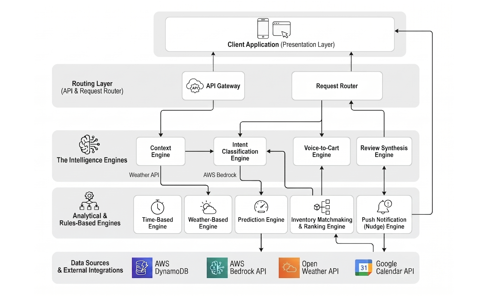

# Amazon Now

A context-aware quick commerce platform that predicts what users need before they search. The application leverages real-time signals — weather, calendar events, and time of day — to build intelligent shopping carts automatically.

**Live Demo:** https://main.d2qyou79awczqz.amplifyapp.com/

---

## Overview

Amazon Now reimagines the quick commerce experience by eliminating the need to manually search for products. The application reads contextual signals from a user's environment and proactively suggests relevant products, reducing time-to-order to a single confirmation tap.

---

## Features

### Context-Aware Smart Cart
- Real-time weather integration determines product suggestions (rain gear during storms, cold drinks during heat)
- Google Calendar integration reads upcoming events and suggests relevant items (party supplies for gatherings, travel essentials before flights)
- Time-of-day awareness suggests meals appropriate to the current hour (breakfast items in the morning, dinner essentials at night)

### Voice Shopping Agent
- Full-duplex voice conversation powered by Retell AI
- Real-time transcript display during conversation
- Live cart building — products appear in the side panel as the user speaks
- Post-call cart editing with quantity controls before checkout

### AI-Powered Search
- Natural language search (e.g., "ingredients for chicken biryani", "snacks for a cricket party")
- Amazon Bedrock Nova Pro interprets intent and generates product recommendations
- Results displayed with individual or bulk add-to-cart options

### Product Catalog
- Category-based browsing (Fresh, Dairy, Snacks, Beverages, Pharmacy, Baby Care, etc.)
- Product cards with delivery time estimates, ratings, and pricing
- Quantity controls with real-time cart updates

### Checkout
- Full checkout flow with delivery address, payment method selection, and order summary
- Delivery time estimation
- Order confirmation with tracking reference

---


<h2>Architecture</h2>

<p align="center">
  
</p>

## AWS Services Used

| Service | Purpose |
|---------|---------|
| Amazon Bedrock (Nova Pro) | AI inference for cart generation, intent classification, review synthesis, and calendar event classification |
| Amazon DynamoDB | User data persistence and cart history storage |
| AWS Amplify | Frontend hosting and continuous deployment |
| AWS IAM | Secure credential management for Bedrock and DynamoDB access |

---

## Tech Stack

| Layer | Technology |
|-------|-----------|
| Frontend | React, Vite, Tailwind CSS, Zustand, Framer Motion |
| Backend | Python, FastAPI, Uvicorn |
| AI/ML | Amazon Bedrock (Nova Pro), Retell AI |
| Database | Amazon DynamoDB |
| Weather | wttr.in (real-time, no API key required) |
| Calendar | Google Calendar API (OAuth 2.0) |
| Hosting | AWS Amplify (frontend), Render (backend) |

---

## Local Development

### Prerequisites
- Python 3.11+
- Node.js 18+
- AWS credentials with Bedrock access
- Retell AI agent configured

### Backend

```bash
cd backend
python -m venv venv
venv\Scripts\activate        # Windows
pip install -r requirements.txt
cp .env.example .env         # Fill in credentials
python -m uvicorn main:app --reload --port 8000
```

### Frontend

```bash
cd frontend
npm install
npm run dev
```

The application will be available at `http://localhost:5173`.

---

## Environment Variables

| Variable | Description |
|----------|-------------|
| AWS_ACCESS_KEY_ID | AWS access key for Bedrock and DynamoDB |
| AWS_SECRET_ACCESS_KEY | AWS secret key |
| AWS_REGION | AWS region (us-east-1) |
| BEDROCK_MODEL_ID | Bedrock model identifier (amazon.nova-pro-v1:0) |
| RETELL_API_KEY | Retell AI platform API key |
| RETELL_AGENT_ID | Retell AI agent identifier |
| GOOGLE_CREDENTIALS_JSON | Google OAuth credentials (for deployed environments) |
| GOOGLE_TOKEN_JSON | Google OAuth token (for deployed environments) |

---

## API Reference

| Method | Endpoint | Description |
|--------|----------|-------------|
| GET | / | Health check |
| GET | /context | Context-aware cart prediction |
| GET | /api/cart/weather | Weather-based cart generation |
| GET | /api/cart/time | Time-based cart generation |
| POST | /api/voice-cart | Natural language to cart (AI) |
| POST | /api/intent | Voice/text intent classification |
| POST | /api/inventory/match | Product ranking and matching |
| POST | /api/retell/create-call | Create Retell voice call session |
| GET | /api/predictions/{user_id} | Purchase history predictions |
| GET | /reviews/{product_name} | AI review synthesis |
| POST | /api/system/trigger | System event simulation |

---

## Team

- Lakshan
- Ajendra
